# VoLTE

* `VoLTE`
  * =`Voice over LTE`
* 出现背景
  * 3GPP Release 8发布了`LTE`
  * 现存几种系统
    * 传统的：（基于`CS`的）语音voice服务
    * 新的：（基于`LTE`的）多媒体短信SMS服务
      * 范围：通过`3G`网络实现的
        * 不带`CS`
      * 几种方案
        * `3GPP`的`CSFB`
        * `IMS`
        * 非国际标准的`VoLGA`
  * `GSMA`建议统一成一种：基于`IMS`的`VoLTE`
    * 其他方式都转换成`IMS`的
      * Voice service migration
        * 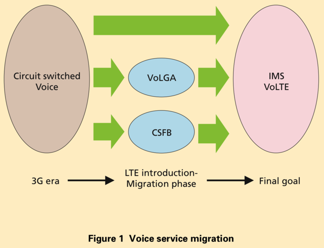
* 为何需要`VoLTE`
  * 如果想要在`4G`网络中实现语音通话=打电话
    * 之前：
      * 需要额外部署实现一套`3G`网络，底层是用基于`CS`的方式，去实现语音数据传输，实现打电话
        * 接入方式效率很低，还需要占用收取授权费的频谱
    * 有了`VoLTE`
      * 在已有的`4G`的`LTE`/`EPC`网络之上，基于`PS`的方式，传输控制信号和语音媒体数据，实现打电话
        * 无需额外的3G网络
        * 大大提高了通信效率
* 现状
  * `VoLTE`广泛流行，主流网络运营商都已支持
* 相关
  * `ViLTE`
    * 作为`VoLTE`的补充
    * 也是`GMSA`制定的规范
    * 也正在被慢慢接受
* 前景
  * `VoLTE`和`ViLTE`逐渐成为基于`IP`的网络的核心服务
    * 就像
      * 语音是`2G`和`3G`网络的核心服务
* 功能
  * 实现高清电话
    * 用于帮助网络运营商对抗`OTT`互联网的`VoIP`服务
* 优势和特点
  * 延迟更低，容量更高
    * 对比
      * `OTT`的`VoIP`
        * 其最大化利用了底层网络能力
          * 会在一定程度上影响音视频服务的质量
  * 支持`QoS`
* 架构
  * `VoLTE`的架构=Profile=configuration
    * VoLTE network configuration
      * 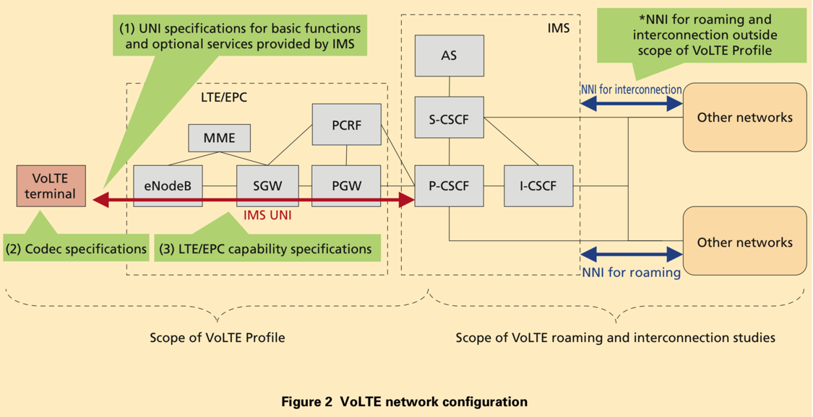
    * -> VoLTE Profile中：
      * 定义了：`UNI`
      * 但是没定义：`NNI`
        * 涉及到不同网络之间的交互和漫游
          * 其他规范中定义了
  * GSMA PRD IR.92 Depiction of UE and Network Protocol Stacks in IMS Profile for Voice
    * 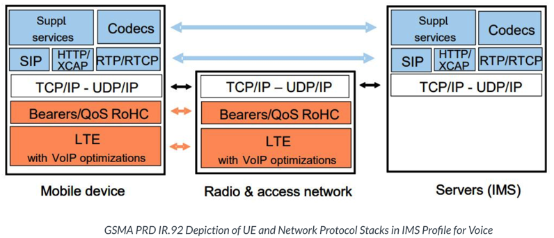
    * 作用
      * VoLTE中的
        * `SIP` 用于 （传输）控制（信号）
          * registration
          * authentication
          * addressing
          * call establishment
          * call termination
        * `SDP` 用于 （传输音视频）数据
          * `RTP` media and bandwidth negotiation
* 服务标准：`SR-VCC`
  * `SR-VCC`=`Single Radio Voice Call Continuity`
  * 背景
    * 当LTE网络还没完全覆盖时，但却又希望提供VoLTE和ViLTE的服务
  * 方案
    * 为了解决当单射频UE在LTE/Pre-LTE 网络和2G/3G CS网络之间移动时，如何保证语音呼叫连续性的问题
    * 3GPP提出的一种VoLTE语音业务连续性方案
    * 实现2G/23到VoLTE的语音电话的无缝衔接
      * 实现voice call continuity=持续性语言呼叫=保持语音的持续性（不断掉）
  * 等级
    * `eSRVCC`= `enhanced SR-VCC`
    * `vSRVCC`= `video SR-VCC`
    * `rSRVCC`= `reverse SR-VCC`
* 具体实现路径（策略）
  * 有多种
    * 根据运营商的不同情况
      * 可用的频谱多少
      * 语音策略
      * 技术架构
      * 商业目标
      * 市场情况
  * 举例
    * 逐渐演化的方式
      * 以`CSFB`开始
      * 先部署好IMS
      * 在`LTE`网络没有完全覆盖之前
        * 再引入`SR-VCC`
    * 一步到位方式
      * 当`LTE`网络完全覆盖后
      * 再直接实现`VoLTE`
* 编解码codec
  * `EVS`=`Enhanced Voice Services`
    * 不同模式
      * `WB`=`WideBand`
      * `SWB`=`Super-WideBand`
      * `FB`=`Full-Band`
    * 不同比特率
* 符合监管Regulatory
  * 美国和加拿大
    * E-911 location requirements
    * text-to-911
    * 紧急和警报服务 emergency and alerting services
    * 合法监听 lawful interception
    * 政府优先服务 government priority services
* 漫游
  * 架构=模型
    * 旧：`LBO`=`Local Breakout`
    * 新：`S8HR`=`S8 Home Routed`
  * 涉及到多个方面
    * 收费 billing and charging
    * 紧急情况 emergency
    * 合法监听 lawful interception
* 实现方案
  * 举例
    * 某公司：CATALEYA
      * 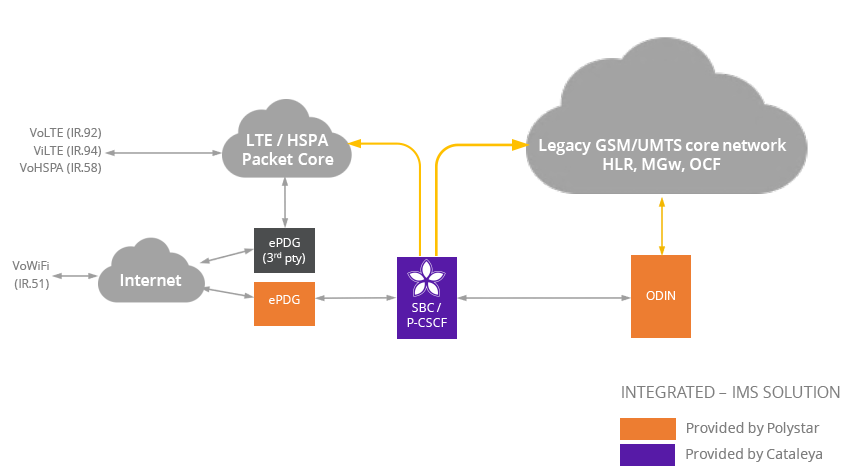

---

* VoLTE
  * VoLTE规范：
    * 定义了
      * 对于
        * 移动端设备
        * 网络
      * （至少）需要支持哪些功能
    * 才能实现
      * 互操作性
      * 高质量的语言服务
        * 基于IMS的
        * 通过LTE实现
  * 历史背景
    * SMS短信
      * SMS over generic IP CAN architecture
        * 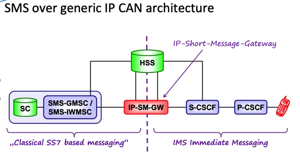
      * SMSoIP - Registration
        * 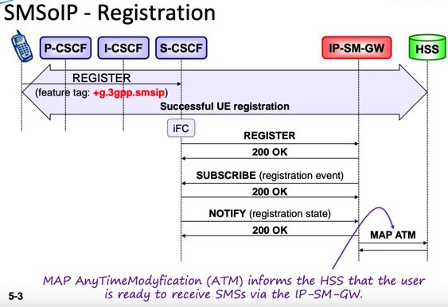
      * UE originated SMS
        * 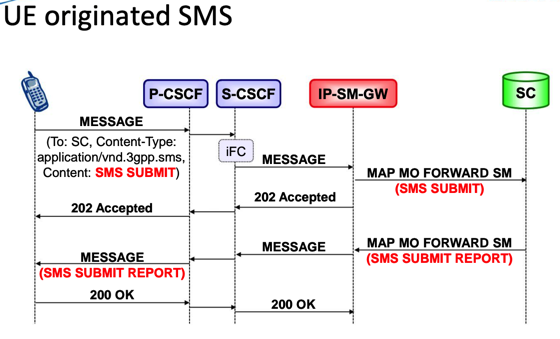
        * 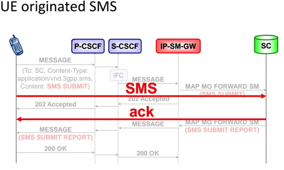
      * UE terminated SMS
        * 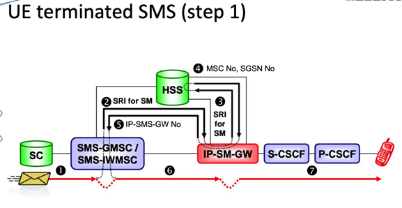
        * 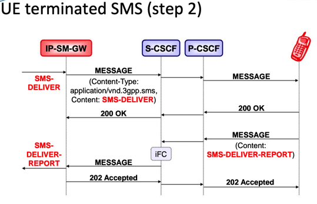
        * 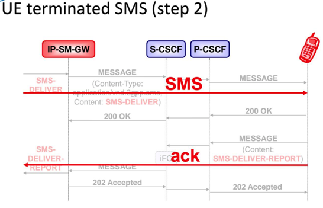
