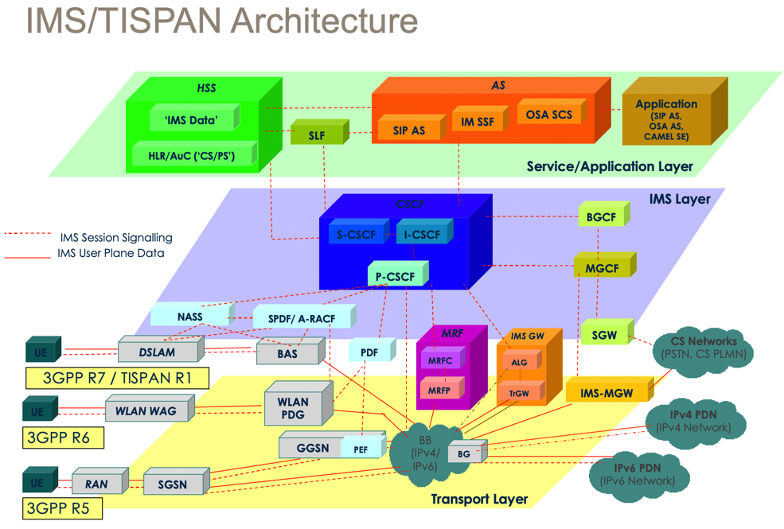

# IMS核心元素

对于IMS架构

其中的：

* 核心元素和简介
  * `AS`=`Application Server`=`应用服务器`
    * Executes service logic associated with value-added services
    * Provides enhanced and intelligent services to subscribers
  * `CSCF`=`Call Session Control Function`=`调用会话控制功能`
      * `P-CSCF`=`Proxy CSCF`
        * is the first point of contact and the control point for the User Equipment (UE) within the Service Provider network. It forwards session requests from the UE to the S-CSCF
      * `S-CSCF`=`Serving CSCF`
        * has access to the user subscription data and actually handles the session request
      * `I-CSCF`=`Interrogating CSCF`
        * is the first contact point within a Service Provider network for all incoming session requests from another Service Provider
  * `BGCF`=`Breakout Gateway Control Function`
    * Identifies the network that will be used for connecting IP sessions to the PSTN
  * `HSS`=`Home Subscriber Server`=`归属用户服务器`=`HSS用户数据库`
    * Stores all the static and dynamic information for a subscriber
    * Maintains a list of features and services associated with a user, and also the location and means of access to the user
    * Provides user profile information
  * `SLF`=`Subscription Locator Function`
    * Queried during Registration and Session Setup to get the name of the HSS containing the required subscriber specific data
  * `MGCF`=`Media Gateway Control Function`
    * Controls the parts of the call state that pertain to connection control for media channels in a T-MGF MGW
    * Selects the CSCF depending on the routing number for incoming calls from legacy networks
    * Performs protocol conversion between ISUP and call control protocols (e.g., SIP) and maintains call states
  * `MRF`
    * `MRFC`=`Multimedia Resource Function Controller`
      * Controls the media stream resources in the MRFP under direction from an S-CSCF or Application Server
      * Interprets information coming from an AS or S-CSCF (e.g., session identifier) and controls MRFP accordingly
    * `MRFP`=`Multimedia Resource Function Processor`
      * Provides media resources under the direction of MRFC
      * May generate media streams (e.g., multimedia announcements), mix incoming media streams for multiple parties, or process media streams (e.g., audio trans-coding, media analysis)
  * `PDF`=`Policy Decision Function`
    * Provides management of network QoS resources, authorization of resource allocations, and makes policy decisions with regard to use of network QoS resources
    * `SPDF`=`Service Policy Decision Function`
  * `T-MGF`=`Trunk Media Gateway Function`
    * Terminates bearer channels from a switched circuit network and media streams from a packet network (e.g., RTP streams in an IP network)
    * Establishes and releases connections between these channels under control of the MGCF in support of calls between PSTN and IP network
  * `SGF`=`Signaling Gateway Function`
    * Acts as a gateway between the IP call/session control signaling and the SS7-based PSTN signaling
    * May provide signaling translation, for example between SIP and SS7 or simply signaling transport conversion e.g., SS7 over IP to SS7 over TDM
  * `A-BGF`=`Access Border Gateway Function`
    * Packet gateway between an access network and a core network used to mask a service provider’s network from access networks, through which UE accessing packet-based services (e.g., IMS, Internet)
    * Functions may include Opening and closing gate, Traffic classification and marking, Traffic policing and shaping, Network address and port translation, and Usage information
    * Under control of the PDF
  * `I-BGF`=`Interconnection Border Gateway Function`
    * Packet gateway used to interconnect a service provider’s core network with another service provider’s core network supporting the packet-based services
    * Functions may be the same as that of the A-BGF
  * `I-BCF`=`Interconnection Border Control Function`
    * Controls I-BGF to interwork with other packet-based networks
    * May support the following functions (not limited to)
      * Inter-domain protocol normalization and/or repair
      * Inter-domain protocol interworking
      * Interaction with PDF for resource reservation, resource allocation, and/or other resource related information
  * `MRB`=`Media Resource Broker`
    * Assigns specific media server resources to incoming calls at the request of service applications (i.e., an AS)
    * Acquires knowledge of media server resources utilization and reservation requests that it can use to help decide which media server resources to assign to resource requests from applications
    * Employs methods/algorithms to determine media server resource assignment
