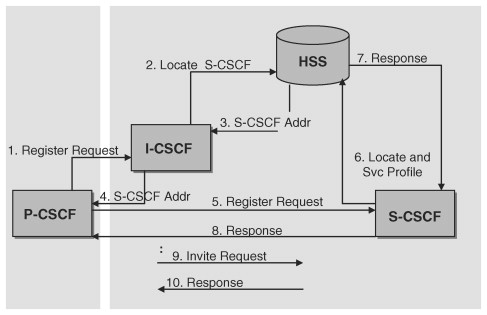

# CSCF

* `CSCF`=`Call Session Control Function`=`调用会话控制功能`
  * 是什么
    * SIP服务器和代理共同实现通话控制功能，统称为：`CSCF`
  * 会话控制流程
    * 
  * 功能：它们在IMS系统中处理SIP信号数据包
  * 包含
    * `P-CSCF`=`Proxy CSCF`
      * 概述
        * is the first point of contact and the control point for the User Equipment (UE) within the Service Provider network. It forwards session requests from the UE to the S-CSCF
        * 是一个SIP代理，作为与IMS终端直联通信点
        * 它可以设置在公网中也可以设置在IMS本网中
        * 某些网络在这个功能组中可能使用了SBC
          * SBC= Session Border Controller=会谈边界控制器
        * P-CSCF其核心是一个特殊的SBC
          * 该SBC使用的用户网络接口不仅保护网络，也保护了IMS终端
          * 在IMS终端和P-CSCF之间传递加密信号时，使用附加的SBC是毫无意义同时也是不可用的。
        * 终端可以使用DHCP协议来找到它的P-CSCF，也可以使用配置（如出厂设置、3GPP IMS管理对象）、或是记录在ISIM中、或是在PDP环境（GPRS PDP Context）中赋值。
      * 其他说明
        * 它在IMS终端注册之前就被分派给IMS终端，并且在注册期间不会改变
        * 它位于所有信号的通路，可以检查所有的信号。IMS终端必须忽略任何其它未加密的信号。
        * 它提供用户的认证，并且为IMS终端创建一个IPsec或TLS连接。这样可以阻止欺骗攻击和重放攻击，并且保护用户的隐私。
        * 它检查信号，确保IMS终端没有企图作弊（比如改变通常信号路游，不遵守IMS网络路游策略）
        * 它也可以使用SigComp压缩和解压缩SIP信息，以降低较慢的无线电链路的负载。
        * 它也可以加入PDF。它可以允许媒体水平的资源（如QoS）可以达到媒体水平。它也可以用作策略控制、带宽管理等等。
          * `PDF`=`Policy Decision Function`=`策略决择功能`
          * `SPDF`=`Serving Policy Decision Function`
          * `QoS`=`Quality of Service`
        * PDF也可以作为独立的功能组
        * 它也产生费用记录
    * `S-CSCF`=`Serving CSCF`
      * 概述
        * has access to the user subscription data and actually handles the session request
        * 从信号层面的来看，S-CSCF是IMS子系统的核心节点
        * 它虽然是SIP服务器，但也负责会话的控制
        * 它永远设置在IMS本网络中，径直地使用Cx和Dx接口访问HSS
        * 它从HSS下载用户配置并且上传用户与S-CSCF关系信息
          * 出于对处理用户配置效率的考虑，S-CSCF会在其本地缓存用户配置。但它不会在本地对用户配置进行更改
        * 所有必要的用户配置信息都会从HSS那里加载
      * 其他说明
        * 它负责处理SIP注册。它会将用户位置（如终端的IP地址）和SIP地址进行绑定。
        * 它位于所有在它那里注册的用户所发出的信号信息的通路上，可以检查所有的信息。
        * 它负责决定SIP信息将抵达哪一个应用服务处理，以完成应用服务。
        * 它提供路游服务，通常是使用电子号码（ENUM - Electronic Numbering）查找
        * 它运行网络运营商的策略
        * 出于分布式负载和高可靠性的原因，IMS网络中允许设置多个S-CSCF。这种情况下，由HSS在用户配置记录哪一个S-CSCF被关系到该用户，而后由I-CSCF来查询这些记录。
    * `I-CSCF`=`Interrogating CSCF`
      * 概述
        * is the first contact point within a Service Provider network for all incoming session requests from another Service Provider
        * 是另一个位于管理域边缘的功能组
        * 它的IP地址通过DNS发布，所以远程服务器可以查找到它，并把它作为向它所在的域传递SIP包的跳点
      * 功能
        * 它查询HSS，获取S-CSCF的地址并且分派给用户以完成SIP注册。
        * 它也为S-CSCF传递SIP请求和回应
        * 直到IMS第6版，它是可以用来把内网隐藏起来，使外部网络无法获取内部网络的信息（加密部分SIP信息）。这里称之为THIG
          * `THIG`=`Topology Hiding Inter-network Gateway`=`隐藏内部网络拓扑网关`
        * 从第7版开始，这个功能从I-CSCF移走，作为IBCF的一部分。IBCF被用作外部网络的网关，提供NAT和防火墙功能。IBCF实际上是NNI的会谈边界控制器的裁剪版本。
          * `IBCF`=`Interconnection Border Control Function`=`互联边界控制功能组`
