# IP-SM-GW

* `IP-SM-GW`=`IP SM GW`=`IP-SM Gateway`=`IP Short-Messaging Gateway`
  * 一句话描述：一个用来实现`SMS over IP`的`AS`
    * `AS`=`Application Server`
  * 背景
    * 希望通过IP发送SMS短信
      * SMS over IP
        * 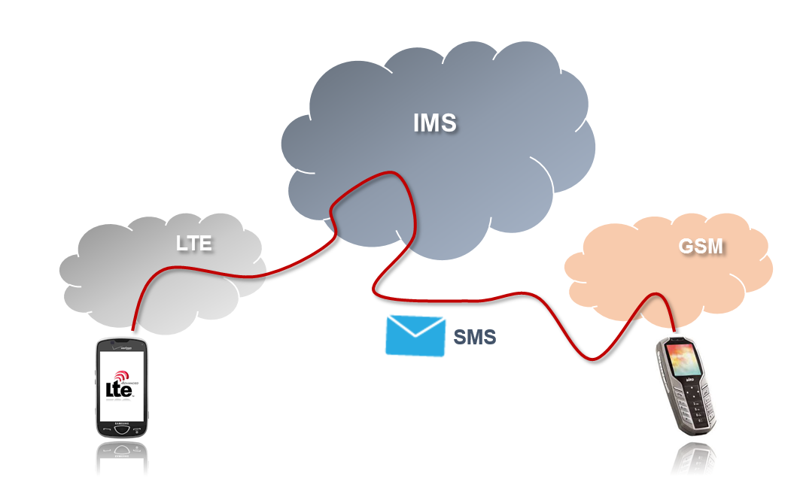
    * IP-SM-GW网络架构
      * 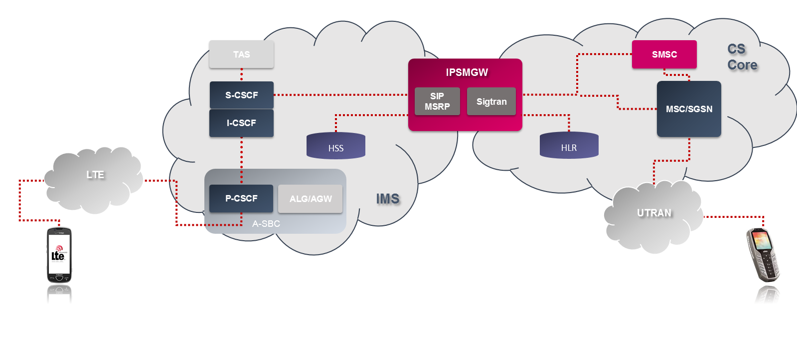
    * 2 IPSMGW sites
      * 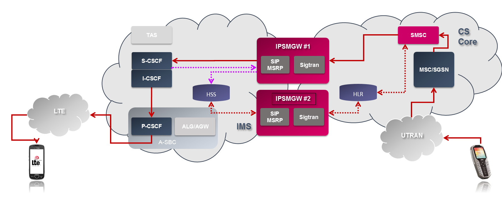
    * IPSMGW – CS Fallback
      * 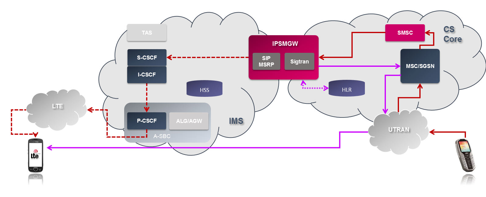
  * 作用
    * 概述
      * The IP-SM-GW shall provide the protocol interworking for delivery of the short message between the IP-based UE and the SMS-SC
      * The message is routed to the SMS-SC for delivery to the SMS-based user or the message is received from the SMS-SC of an SMS-based UE for delivery to an IP-based UE
    * 包括
      * to determine the domain (CS/PS or IMS) for delivery of a Short Message
      * to connect to the SMS-GMSC using established MAP protocols, appearing to the SMS-GMSC as an MSC or SGSN using the E or Gd interfaces
      * to respond to Send Routeing Information for Short Message requests made by the SMS-GMSC, and forwarded from the HSS, with its own address
      * to connect to the SMS-IWMSC using established MAP protocols, appearing to the SMS-IWMSC as an MSC or SGSN using the E or Gd interfaces
      * to connect to the HSS using established MAP protocols , to obtain the address of MSC/SGSN address(es) for SM termination in CS/PS
      * to acquire and maintain knowledge of the association between the MSISDN, IMSI and the address of the S-CSCF serving of the user;
      * to check that it has a valid address in SMS for the sender as well as the recipient when receiving an IMS message for an SMS user. The IP-SM-GW shall obtain a valid address for both from the SIP headers of the IMS message (e.g. the sender would be identified in the asserted id in form of TEL URI);
      * for terminating procedures, to map the recipient’s address from an MSISDN/IMSI to TEL URI format when receiving an SMS for an IP-based UE, and then it is the responsibility of the IMS core to perform any further mapping towards a SIP URI as required;
      * to act as an Application Server towards the IMS core;
      * to perform domain selection to choose the appropriate domain to deliver a message to a recipient and to obtain the MSC and/or SGSN addresses from the HSS; and
      * to manage flags indicating user availability for SMS termination in the HSS
  * 架构
    * Architecture for providing SMS over a generic IP-CAN
      * 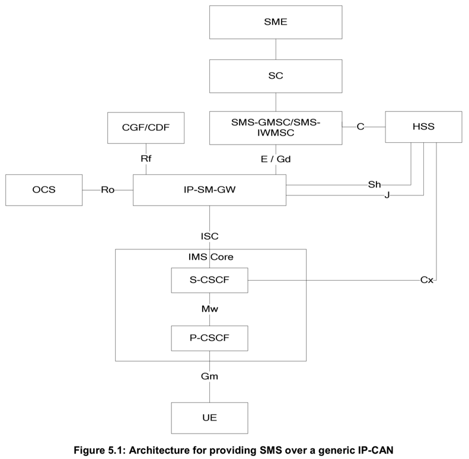
      * 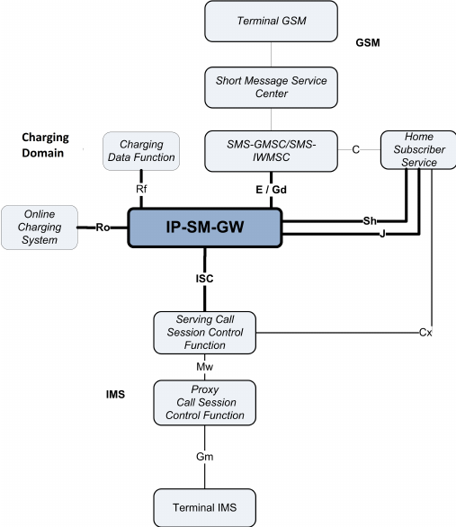
      * 
    * 子模块
      * IP-SM-GW stack
        * 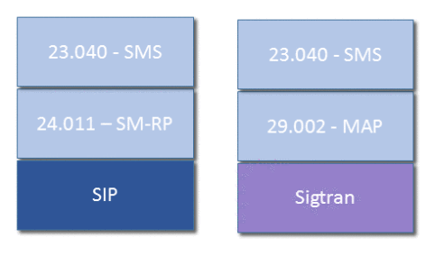
      * IP-SM-GW Transport layer
        * 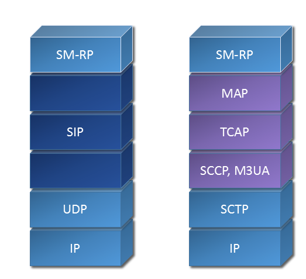
  * 相关
    * Short Message delivery with Transport-Level interworking
      * 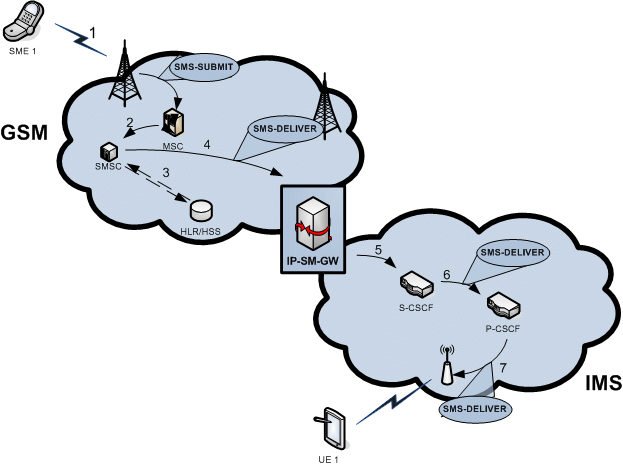
    * Sh Reference Point
      * 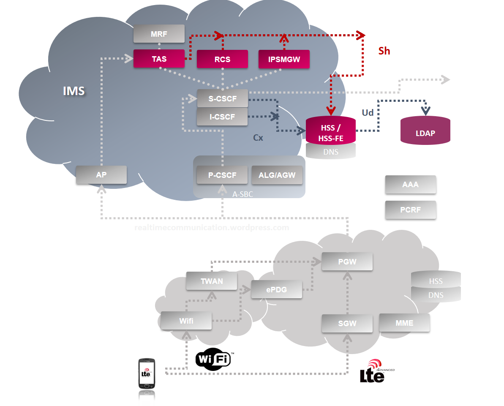
    * Sh for Failover
      * 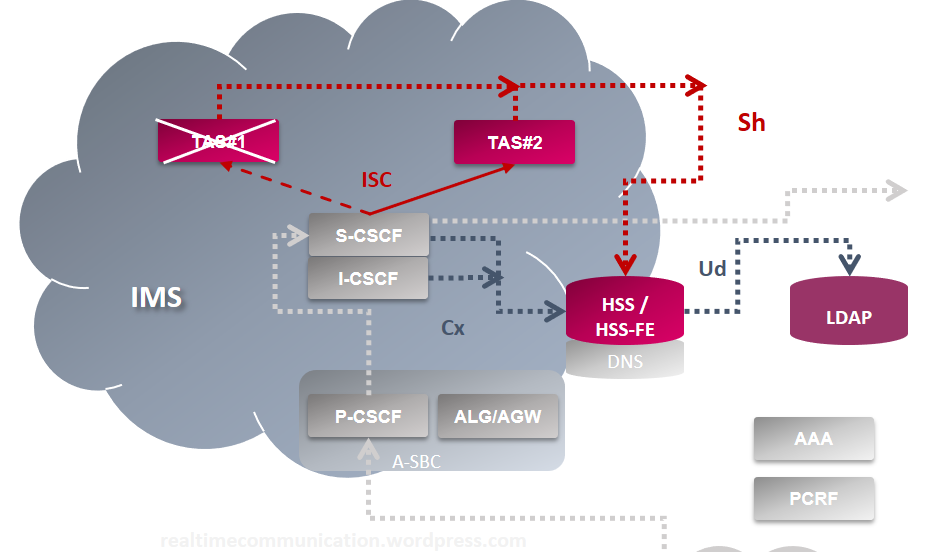
  * 具体实现
    * Sentinel
      * SentinelIP-SM-GW in an LTE network
       * 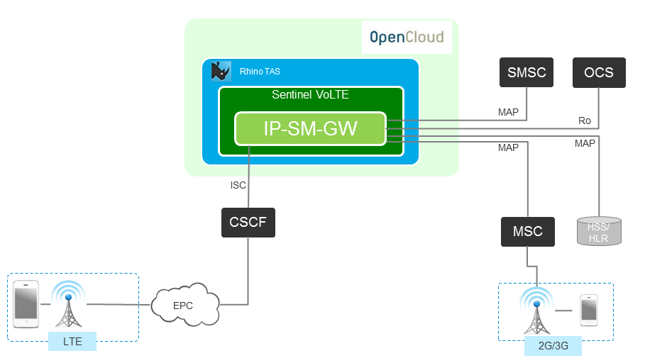
    * GL
      * Simulation of IP-SM-GW for SMS over IMS Network
        * 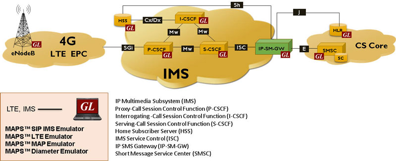
