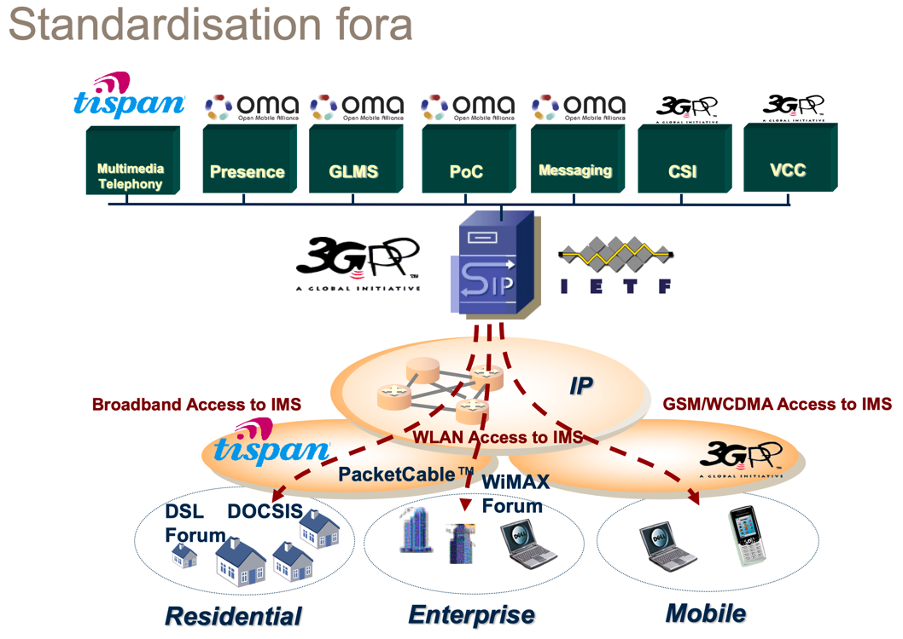
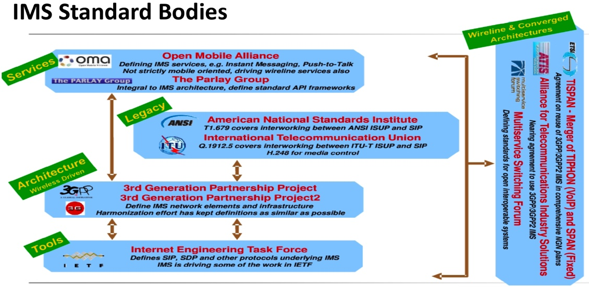

# IMS组织关系

此处整理IMS及相关组织和协议的关系：

* 
* 

具体细节是：

* `IMS`
  * 是`3GPP`组织定义的
    * 利用了现有的各种协议
      * `IETF`
        * 资源定位
          * `URI`
            * 新
              * RFC 3986 
            * 旧：
              * RFC 2396
        * 会话控制
          * `SIP`
            * RFC 3261
          * `SDP`
            * RFC 2327
        * 授权和认证
          * Diameter=Diameter Base Protocol
            * 新
              * RFC 6733
            * 旧
              *  RFC 3588
              * RFC 5719
          * HTTP Authentication: Basic and Digest Access Authentication
            * RFC 2617
              * 格式：Authorization: Basic <credentials>
        * 实时数据传输
          * `RTP`
            * RFC 3550
      * `3GPP`
        * TS 23.060
          * GPRS
        * TS 23.228
          * IMS (stage 2)
        * TS 24.228
          * Signalling flows for the IP multimedia call control based on SIP and SDP
        * TS 24.229
          * IP multimedia call control protocol based on Session Initiation Protocol (SIP) and Session Description Protocol (SDP), Stage 3
        * TS 24.279
          * Combining Circuit Switched (CS) and IP Multimedia Subsystem (IMS) services, Stage 3
        * TS 25.301
          * UTRAN
        * TS 29.228
          * IP Multimedia (IM) Subsystem Cx and Dx Interfaces; Signalling flows and message contents
        * TS 29.229
          * UMTS  LTE Cx and Dx interfaces based on the Diameter protocol
      * `OMA`
        * Instant Messaging using SIMPLE Architecture
        * Instant Messaging Requirements
        * Instant Messaging using SIMPLE
        * Presence SIMPLE Architecture
        * Resource List Server (RLS) XDM Specification
* `3GPP`=`3rd Generation Partnership Project`=`第三代合作伙伴计划`
  * 是什么：一个组织机构
  * 目标：统一各方的电信方面的标准
    * 在国际电信联盟的`IMT-2000`计划范围内制订和实现全球性的（第三代）移动电话系统规范。
    * 致力于`GSM`到`UMTS`(`W-CDMA`)的演化
  * 各方（合作伙伴）包括
    * 日本：`ARIB`、`TTC`
    * 欧洲：`ETSI`
    * 中国：`CCSA`
    * 韩国：`TTA`
    * 美国：`ATIS`
    * 印度：`TSDSI`
  * 具体制定标准
    * 组织形式
      * `TSG`=`Technical Specification Group`=`技术规范组`
        * `WG`=`Working Group`=`工作组`
    * 现状
      * 目前有3个`TSG`，每个`TSG`下面又有多个`WG`
        * 不过每个`TSG`中的每个`WG`负责不同方面的内容
      * 具体关系
        * `RAN`=`Radio Access Network`
          * RAN WG1：Radio Layer 1 specification
          * RAN WG2：Radio Layer 2 and Radio Layer 3 RR specification
          * RAN WG3：Iub Iur and Iu specification – UTRAN O&M requirements
          * RAN WG4：Radio performance and protocol aspects (system) – RF parameters and BS conformance
          * RAN WG5：Mobile terminal conformance testing
          * RAN WG6：GERAN radio and protocol
        * `SA`=`Service and System Aspects`
          * SA WG1：Services
          * SA WG2：Architecture
          * SA WG3：Security
          * SA WG4：Codec
          * SA WG5：Telecom Management
          * SA WG6：Mission-critical applications
        * `CT`=`Core Network and Terminals`
          * CT WG1：MM/CC/SM (lu)
          * CT WG2：closed
          * CT WG3：Interworking with external networks
          * CT WG4：MAP/GTP / BCH/SS
          * CT WG5：OSA (Now transferred to OMA)
          * CT WG6：Smart Card Application Aspects
* `3GPP2`
  * 目标：致力于以`IS-95`（在北美和韩国应用广泛的`CDMA`标准，中国电信`CDMA`与之兼容）向`IS-2000`过渡
  * 说明
    * 和高通公司关系更加紧密
    * `3GPP`和`3GPP2`两者实际上存在一定竞争关系
