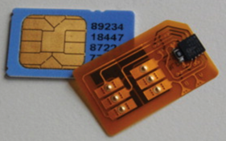
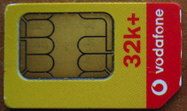
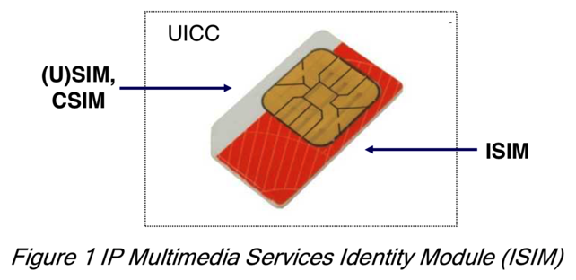
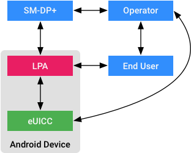

# SIM卡

* SIM
  * `UICC`=`Universal integrated circuit card`
    * 别称：`SIM卡`
    * 含义：在`GSM`或`UTMS`网络中移动终端中的智能卡=`SIM卡`
    * 图
      * 
      * 
      * 
    * 细节
      * 包含应用（程序）
        * 不同网络
          * `GSM`网络中，`UICC`中包含一个`SIM`应用
          * `UTMS`网络中，`UICC`中包含一个`USIM`应用
          * `cdmaOne`/`CDMA2000`网络中，`UICC`除了包含`USIM`和`SIM`外，还包含一个`CSIM`应用
        * 一张卡可能包含多个程序
          * 一张卡可能同时支持`GSM`和`UTMS`
  * `ISIM` = `IMS SIM`
    * 是什么：一种应用程序application
  * `USIM` = `Universal SIM` = `SIM`
  * UICC vs SIM vs ISIM vs USIM vs CSIM 关系
    * 

## eSIM

* 传统=之前：把`安全元素`=`Secure Element`信息保存到`SIM卡`
* 现在=新的方式：可以把`Secure Element`保存到任意设备中
  * 新方案：`eSIM`
    * 需要
      * 一种新的加载机制
        * 需要新的可信平台和各种玩家一起配合
    * 新技术：Remote SIM Provisioning technology
      * 2种渠道
        * Consumer Solution=消费者方案=direct to consumer
        * M2M solution=M2M方案= B2B2C=business to business to consumer
          * 主要用于`IoT`
* 支持情况
  * Android
    * 支持eSIM
      * 利用嵌入式 SIM（又称 eSIM 或 eUICC）技术，移动用户可以在没有实体 SIM 卡的情况下，下载运营商配置文件并激活运营商服务。该技术是由 GSMA 推动的全球规范，支持在任何移动设备上进行远程 SIM 配置 (RSP)。从 Android 9 开始，Android 框架为访问 eSIM 和管理 eSIM 上的订阅配置文件提供了标准 API。借助这些 eUICC API，第三方可以在支持 eSIM 的 Android 设备上开发自己的运营商应用和 Local Profile Assistant (LPA)。
      * LPA 是一款独立的系统应用，应包含在 Android 构建映像中。eSIM 上的配置文件通常由 LPA 管理，因为 LPA 充当着 SM-DP+（准备、存储配置文件包并将其提供给设备的远程服务）和 eUICC 芯片之间的桥梁。LPA APK 可以视需要包含一个界面组件（又称 LPA 界面，简称 LUI），以便为最终用户提供一个中心位置来管理所有嵌入式订阅配置文件。Android 框架可自动发现可用的最佳 LPA 并与之连接，然后通过 LPA 实例路由所有 eUICC 操作
    * 架构
      * 
